# W601智能采集应用程序

作者：马龙伟

## 1. 简介

&emsp;&emsp;基于W601开发板的智能采集应用通过MODBUS-TCP协议采集外部数据存储在内部，并在其内部集成了web服务器，可以通过网页浏览数据。web服务器还集成了重启和更新固件功能，可以通过网页对开发板进行重启操作和更新固件操作，大大方便了以后更新程序。

## 2. 功能描述

1. smartconfig配网并支持自动连接记录的AP
2. MODBUS-TCP协议采集数据存储
3. web服务器网页显示和对开发板进行操作
4. adbd更新文件系统文件
5. 通过MQTT将数据传到onenet端
6. LCD显示获取的IP地址，指示灯运行指示
7. 按键输入控制

## 3. 使用到的软件包

1. adbd软件包

&emsp;&emsp;adbd软件包本项目主要用来传输文件系统中的文件，当前版本主要是上传web服务器所需要的文件。
配置如下：

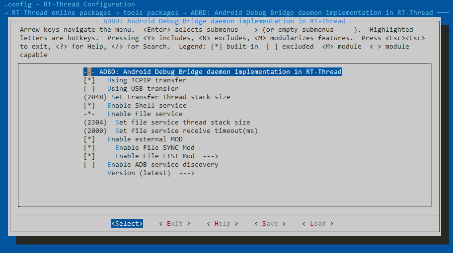
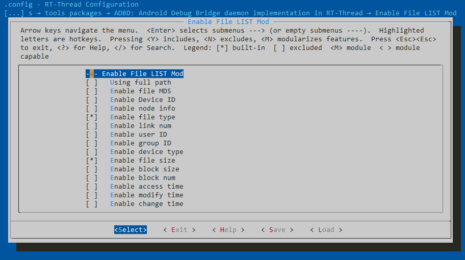

2. agile_button软件包

&emsp;&emsp;agile_button软件包对按键进行了封装简单易用，本项目使用其来作为输入。
配置如下：

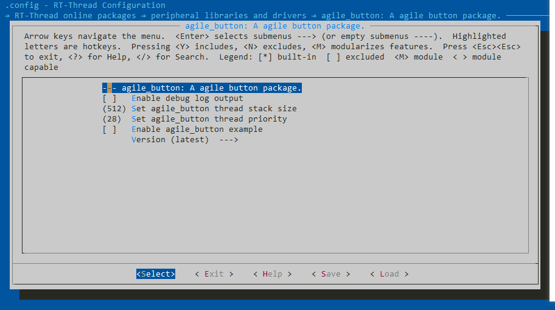

3. agile_led软件包

&emsp;&emsp;agile_led软件包对led进行了封装简单易用，本项目使用其作为简单的指示效果。
配置如下：

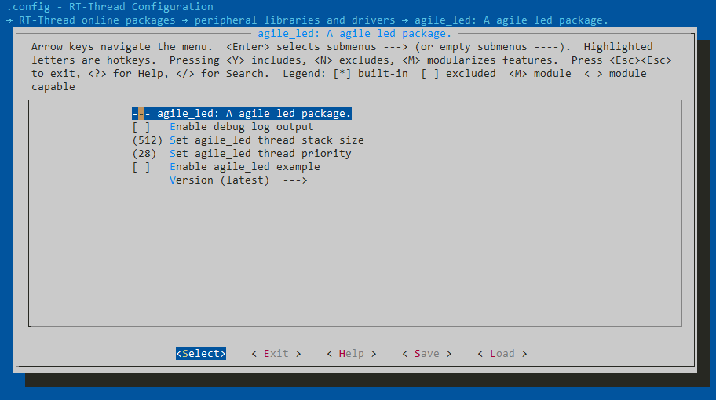

4. cJSON软件包

&emsp;&emsp;cJSON软件包提供了json格式数据解析和封包，本项目主要使用到json封包功能。
配置如下：

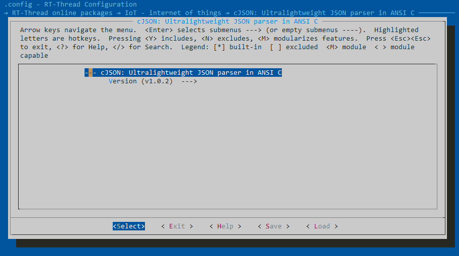

5. EasyFlash软件包

&emsp;&emsp;EasyFlash软件包是一款轻量级嵌入式Flash存储器库，本项目主要使用其用于wifi配置参数存储。
配置如下：

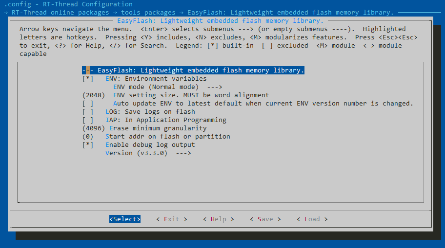

6. fal软件包

&emsp;&emsp;fal软件包是对Flash及基于Flash的分区进行管理、操作的抽象层，本项目主要使用其对片内片外flash进行分区。
配置如下：

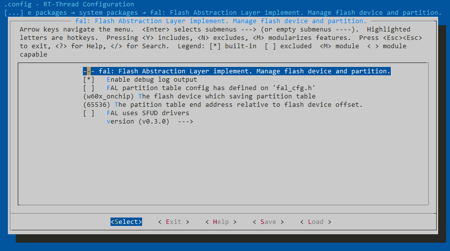

7. libmodbus软件包

&emsp;&emsp;libmodbus软件包对MODBUS-RTU和MODBUS-TCP协议进行了封装，简单易用，本项目主要使用其MODBUS-TCP功能采集外部数据。
配置如下：

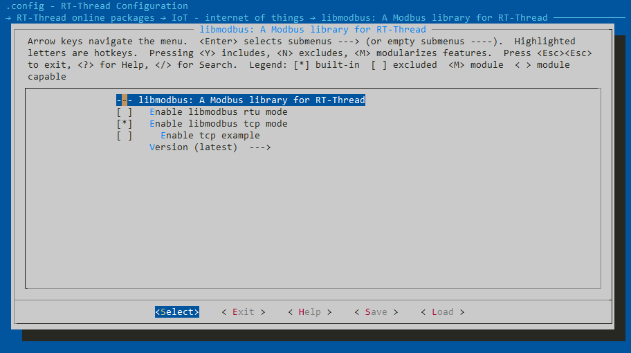

8. netutils软件包

&emsp;&emsp;netutils软件包里有很多网络小工具，本项目主要使用NTP校时功能。
配置如下：

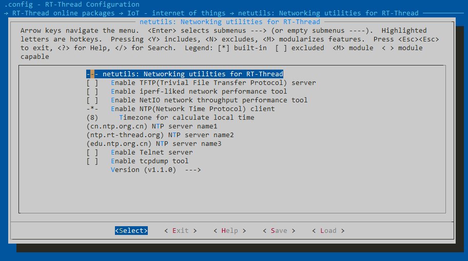

9. onenet软件包

&emsp;&emsp;本项目使用onenet软件包将数据推送到onenet云平台。
配置如下：

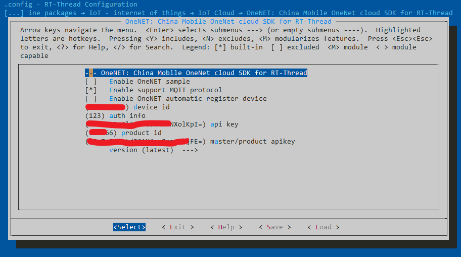

10. pahomqtt软件包

&emsp;&emsp;onenet软件包使用mqtt协议，依赖此软件包。
配置如下：

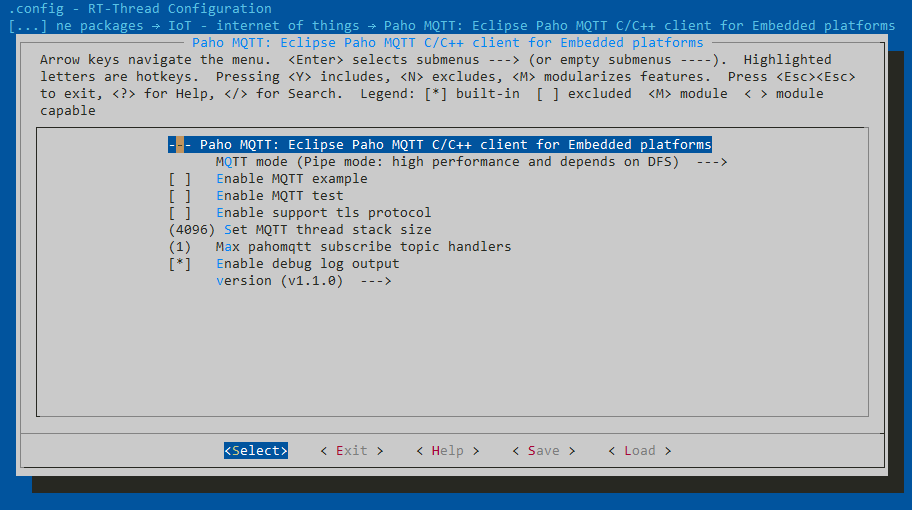

11. tinycrypt软件包

&emsp;&emsp;adbd软件包依赖。
配置如下：


12. webclient软件包

&emsp;&emsp;onenet软件包依赖。
配置如下：

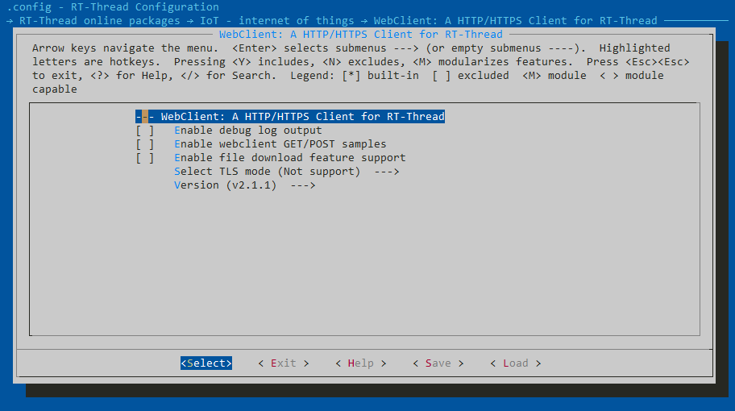

13. webnet软件包

&emsp;&emsp;WebNet 软件包是RT-Thread自主研发的，基于HTTP 协议的Web服务器实现，本项目使用其在网页上展示数据并能够通过网页重启设备及固件升级。
配置如下：


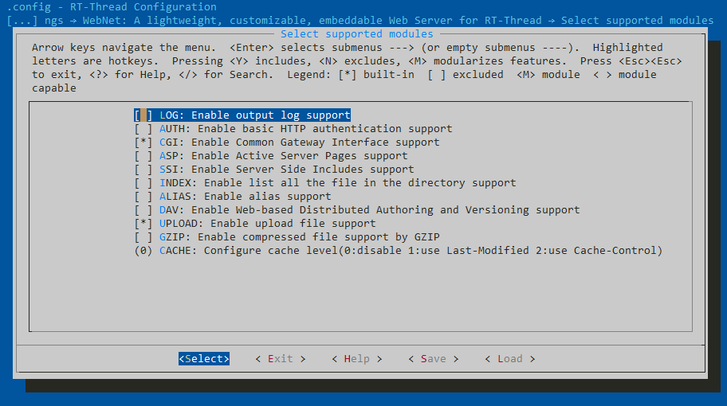

## 4. 软件框架

### 4.1 线程间通信ZMQ

&emsp;&emsp;本项目线程间通信多数使用消息队列形式推送信息，但是使用原生API `rt_mq_xx`需要指定mq过于繁琐，我将其封装了一层，称之为ZMQ。通过对过滤字订阅(subscribe)和发布(publish)实现线程间简洁的通信。

消息结构体如下：
```C
typedef struct 
{
    zmq_opt_t msg_src;
    ipc_msg_type_t msg_type;
    uint16_t len;
    uint8_t *data;
}ipc_msg_t;
```

|成员|说明|
|---|---|
|msg_src|消息源过滤字|
|msg_type|消息类型|
|len|data区长度|
|data|数据区|

如下是一个简单的使用例子:

led线程订阅

```C
static void led_msg(void *parameter)
{
    ipc_msg_t msg = IPC_MSG_INITIALIZER;
    uint8_t net_connected = 0;
    uint8_t reset_lock = 0;
    uint8_t wifi_cfg_ok = 0;
    while (1)
    {
        if (zmq_subscribe(&msg, ZMQ_OPT_LED, RT_WAITING_FOREVER) == RT_EOK)
        {
            switch (msg.msg_type)
            {
            case MSG_TYPE_RESET:
                if(reset_lock == 0)
                {
                    sys_led_reset();
                    reset_lock = 1;
                }
            break;
            default:
            break;
            }
            rt_free(msg.data);
            msg.data = NULL;
        }
    }
}
```

key事件发布：

```C
if(btn->hold_time >= RESET_TIME)
{
    ipc_msg_t send_msg = IPC_MSG_INITIALIZER;
    zmq_load_msg(&send_msg, ZMQ_OPT_KEY, MSG_TYPE_RESET, RT_NULL, 0);
    zmq_publish(&send_msg, ZMQ_OPT_DCU);
}
```

### 4.2 主程序

&emsp;&emsp;主程序主要负责初始化各个模块功能，初始化文件系统，初始化wlan自动连接等。

### 4.3 webnet初始化

&emsp;&emsp;本项目比较有难度的就是webnet的使用，webnet是一个web服务器，这就必然涉及到前后端，后端使用的是cgi；前端我已经写好了，不过写的比较简单(日后完善)，html+css网上资源太多。

&emsp;&emsp;这里主要看一下cgi和upload模块的使用。如下：

```C
int webnet_create(void)
{
    webnet_cgi_register("sysreset", cgi_sysreset_handler);
    webnet_cgi_register("dev_data", cgi_devdata_handler);
    
    webnet_upload_add(&upload_bin_upload);

    /* start WebNet */
    webnet_init();
    return RT_EOK;
}
```

&emsp;&emsp;由于时间太紧，就做了简单的功能哈。cgi模块包括重启设备和获取采集数据功能。upload模块包括固件升级功能。

&emsp;&emsp;cgi使用很简单，根据官方例子看一下基本就会用了。这里获取设备数据我是用到了json封包，因为前端数据通信用的最多的就是json格式，毕竟前端js是吧。如下：

```C
#define cgi_head()                       \
    const char *mimetype;                \
    mimetype = mime_get_type(".html");   \
    session->request->result_code = 200; \
    webnet_session_set_header(session, mimetype, 200, "Ok", -1);

void cgi_sysreset_handler(struct webnet_session *session)
{
    cgi_head();
    webnet_session_printf(session, "{\"code\":0}");

    ipc_msg_t send_msg = IPC_MSG_INITIALIZER;
    zmq_load_msg(&send_msg, ZMQ_OPT_WEB, MSG_TYPE_RESET, RT_NULL, 0);
    zmq_publish(&send_msg, ZMQ_OPT_DCU);
}

void cgi_devdata_handler(struct webnet_session *session)
{
    cgi_head();
    char *body = RT_NULL;
    if (session->request->query_counter)
    {
        body = json_create_collect_items();
        if(body != RT_NULL)
        {
            webnet_session_printf(session, body);
            rt_free(body);
        }
        else
        {
            webnet_session_printf(session, "{\"code\":-1}");
        }
    }
}
```

&emsp;&emsp;固件升级使用到了upload模块，也比较简单就是将官方例子中的upload上传文件，改成使用fal写到download分区中。

### 4.4 软件框架总结

&emsp;&emsp;总体就是创建各个线程，然后通过ZMQ通信。因为软件包太好用了，绝大部分都是调软件包的API，根据软件包自身的demo改改就能很快用起来啦。

## 5. 演示

### 5.1 网页数据浏览演示

路由器网速比较卡，所以刷新会有一顿一顿的感觉。
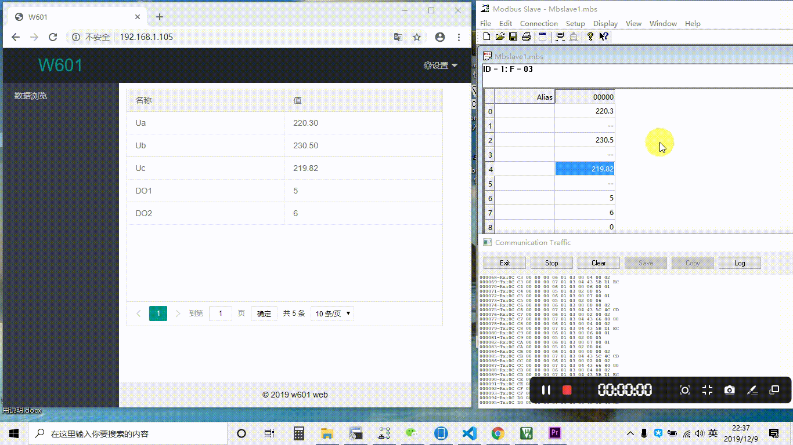

### 5.2 网页重启设备演示

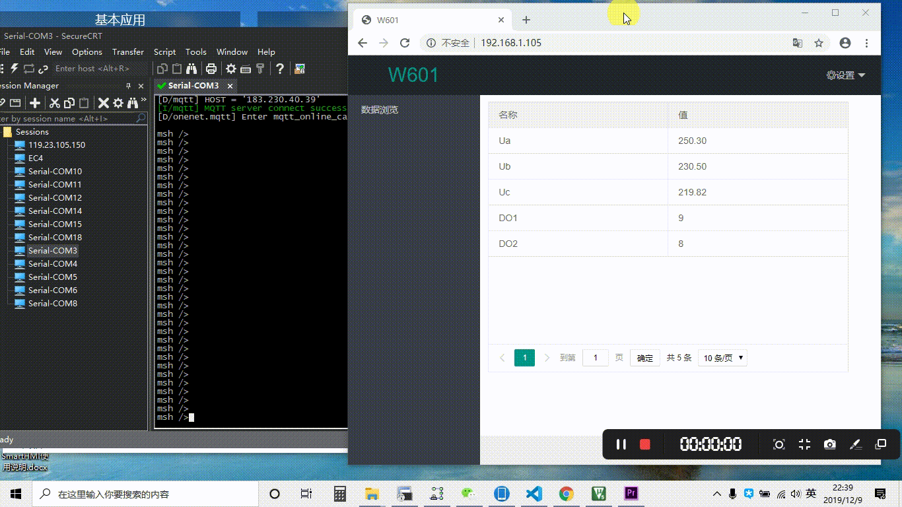

### 5.3 网页固件升级演示


### 5.4 onenet平台数据显示

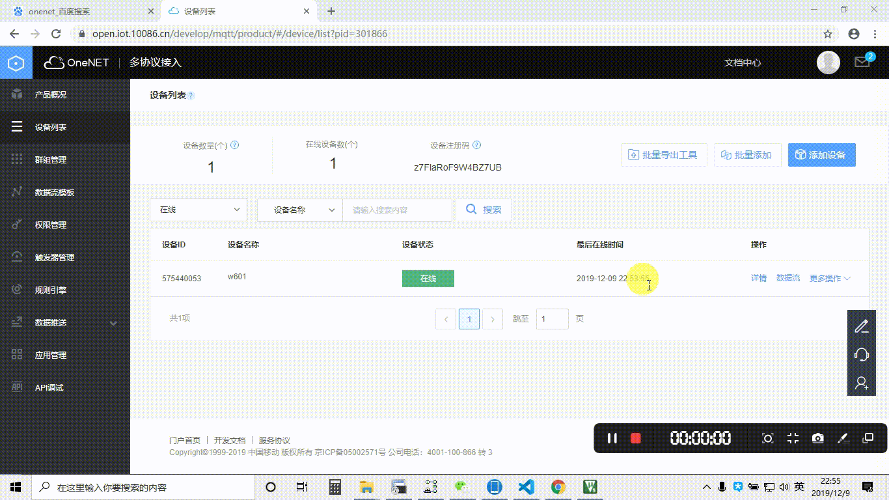
